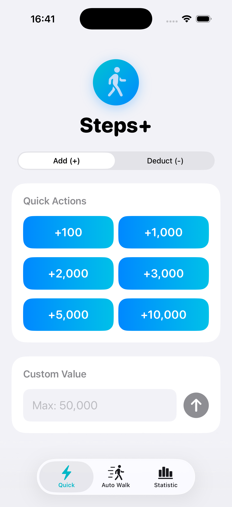
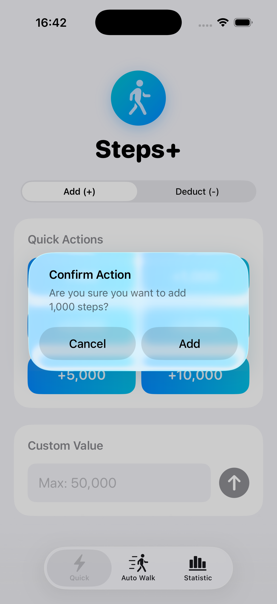
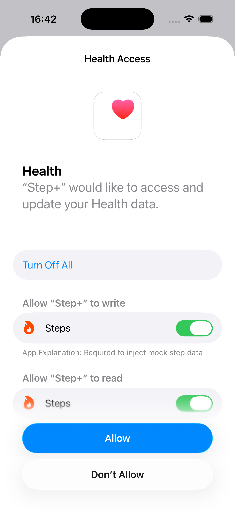
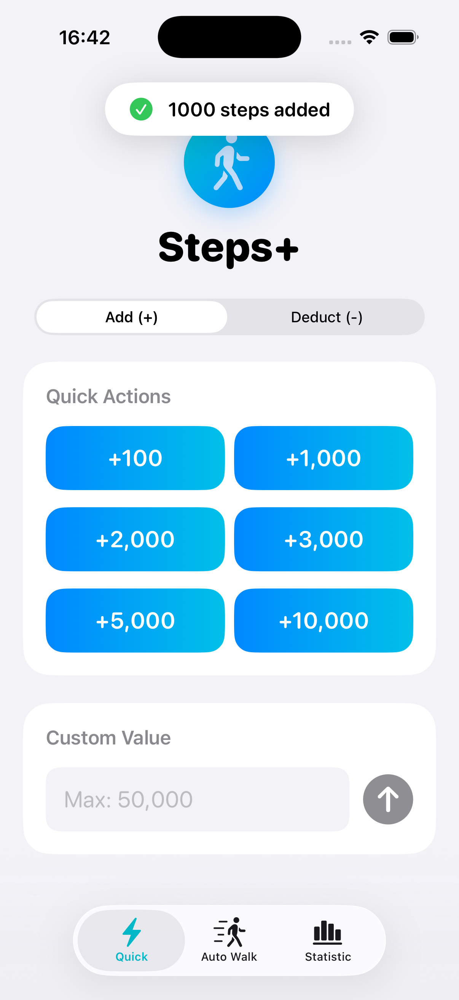
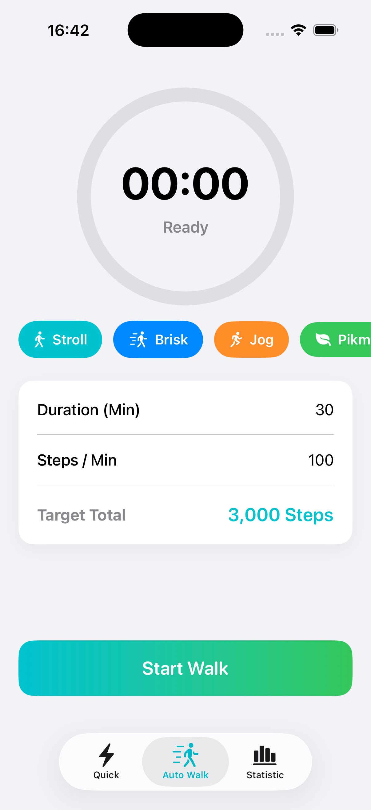
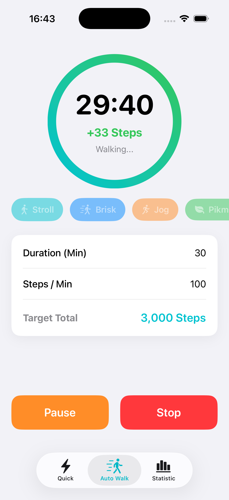
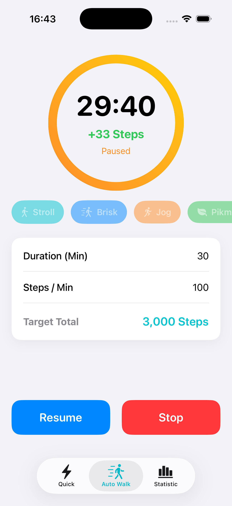
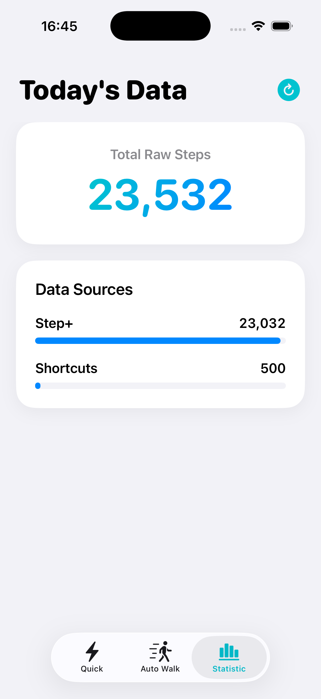

# Steps+ 🚶‍♂️

A lightweight, native iOS utility for simulating and managing Apple Health step data. Built with SwiftUI, HealthKit, ActivityKit, and App Intents.

Originally developed as a testing tool for location-based applications and a companion utility for games like Pikmin Bloom (Adventure Sync), Steps+ allows you to safely inject, deduct, and simulate gradual walking data directly on your device.

---

## 📸 Screenshots

### ⚡️ Quick Inject & Control Center
Instantly add or safely remove mock steps. Features preset values, custom inputs, and system-wide iOS Control Center integration for injecting steps without opening the app.

<p align="center">
  
  
  
  
</p>

### ⏱ Auto Walk & Presets
Simulate gradual movement over time. Set your duration and pace, or use built-in presets (Stroll, Brisk, Jog, and a specialized Pikmin mode at 110 steps/min).

<p align="center">
  
  
  
</p>

### 🏝 Live Activity & Configs
Monitor your Auto Walk progress directly from the Lock Screen and Dynamic Island. Granular settings allow you to adjust step limits, humanize your data, and control the widget refresh rate.

<p align="center">
  
  
</p>

### 📊 Daily Statistics
View a real-time breakdown of your daily steps separated by data source (iPhone, Apple Watch, and Steps+).

<p align="center">
  
</p>

---

## ✨ Core Features
* **Bulletproof Background Execution:** A highly optimized GCD (Grand Central Dispatch) timer paired with a silent, native WAV audio engine allows Auto Walk to run flawlessly while the screen is locked, completely bypassing iOS's aggressive background suspension. Extremely memory-efficient (~35 MB footprint).
* **Live Activities & Dynamic Island:** View your real-time step injection progress from the Lock Screen. Includes a user-configurable update interval (10–60s) to balance responsiveness while staying safely under Apple's ActivityKit update budgets.
* **Humanized Data:** Optional anti-cheat safeguard that applies a ±15% randomized variance to your walk speed, mimicking natural human movement rather than mechanical batching.
* **True Deduction:** Apple Health natively blocks negative numbers. The "Deduct" feature intelligently queries past records explicitly created by Steps+ and safely deletes them to reach your target deduction.
* **Safety Safeguards:** Built-in caps prevent single injections over 50,000 steps. Features a customizable Daily Maximum limit and approach warnings to prevent accidental HealthKit database corruption or suspicious activity flags in companion apps.
* **Interactive App Intents:** Native integration with modern iOS interactive widgets, Control Center, and the Action Button.

## 🛠 Requirements
* **iOS 17.0+** (iOS 18+ recommended)
* **Xcode 15.0+** (for building and deploying)
* An active Apple ID (Free or Developer)

## 🚀 Installation (Sideloading)

Because this app manipulates Apple Health data, it must be compiled locally and deployed directly to your own device.

1. Clone the repository:
   ```bash
   git clone [https://github.com/YOUR-USERNAME/StepsPlus-iOS.git](https://github.com/YOUR-USERNAME/StepsPlus-iOS.git)
   ```
2. Open `StepInjector.xcodeproj` in Xcode.
3. In the **Signing & Capabilities** tab, check **Automatically manage signing** and select your Apple ID from the Team dropdown.
4. Connect your iPhone to your Mac.
5. On your iPhone, toggle ON **Settings > Privacy & Security > Developer Mode** (requires a restart).
6. Select your iPhone in Xcode and click **Run**.
7. Go to **Settings > General > VPN & Device Management**, tap your Apple ID, and select **Trust**.

*Note: Free Apple Developer accounts require refreshing the app certificate every 7 days via Xcode. Your Health data and permissions will remain permanently intact.*

## 📝 License
This project is open-source and available under the MIT License. It is intended for educational purposes, software testing, and personal utility.
